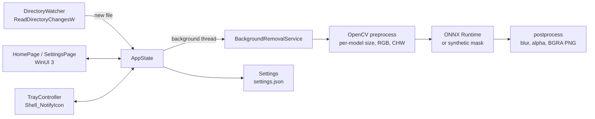

<div align="center">

# SnapBGR

**Automatic, private, on-device background removal for Windows.**

Drop an image into a folder — get a transparent PNG back. No cloud, no
subscription, no upload. Your photos never leave your PC.

[](https://github.com/patelnet/snapbgr/actions/workflows/ci.yml)
[](https://github.com/patelnet/snapbgr/releases/latest)
[](installer/LICENSE.txt)

[**Download**](https://github.com/patelnet/snapbgr/releases/latest) ·
[Getting started](#getting-started) ·
[AI models](#ai-models) ·
[FAQ](#faq--troubleshooting) ·
[For developers](#for-developers)

</div>

---

## Highlights

- 🖼️ **Set-and-forget** — watches a folder of your choice; every image
  that lands there is processed automatically into a transparent PNG.
- 🔒 **100% on-device** — inference runs locally via ONNX Runtime. No
  network calls, no telemetry, no account.
- 🧠 **Bring your own model** — works with MODNet, U²-Net, IS-Net,
  BiRefNet, RMBG and more. Drop in any `.onnx` file — input size and
  normalization are detected automatically, no renaming required.
- 🗂️ **Never destructive** — originals are untouched; outputs get
  timestamped names and never overwrite existing files.
- 📌 **Lives in the system tray** — live status (queue, current file,
  active model), start/stop, folder pickers, model picker.
- 📦 **Proper Windows citizen** — MSI installer with per-user *or*
  all-users scope, Start Menu shortcut, clean uninstall, in-place
  upgrades.

## Installation

1. Download `SnapBGR-<version>.msi` from the
   [latest release](https://github.com/patelnet/snapbgr/releases/latest).
2. Run it. The setup wizard asks whether to install **just for you** (no
   admin rights needed → `%LOCALAPPDATA%\Programs\SnapBGR`) or
   **for all users** (UAC prompt → `Program Files\SnapBGR`),
   and lets you pick the install folder.
3. Launch **SnapBGR** from the Start Menu.

Release pages include SHA256 checksums for every asset. The MSI is not
yet code-signed, so SmartScreen may prompt on first run — verify the
checksum and choose *More info → Run anyway*. Uninstall any time from
*Settings → Apps*.

A portable single-file `SnapBGR-<version>.exe` (no installer, no DLLs —
just download and run) is also published with each release.

**System requirements:** Windows 10/11, 64-bit. No additional runtimes —
all dependencies (including the VC++ runtime) ship inside the package.

## Getting started

SnapBGR runs in the **system tray** (notification area — check
the taskbar's `^` overflow chevron). Out of the box it watches
`Pictures` and writes results to `Pictures\BackgroundRemoved`.

Right-click the tray icon:

| Menu item | What it does |
|---|---|
| *Status header* | Watch state, file being processed, queue depth, done/failed counts, active model (family + resolution), output format |
| **Start / Stop Watching** | Toggle folder monitoring |
| **Select Watched Folder…** | Choose which folder to monitor (persisted) |
| **Select Output Folder…** | Choose where results go (persisted) |
| **Open Output Folder** | Jump straight to your results |
| **Select Model…** | Pick any `.onnx` background-removal model |
| **Get Compatible Models** | Opens the model download catalog |
| **Output Format** | PNG (transparent, default) or JPG (white background) |
| **CPU Usage** | Normal (full speed), Low (background priority, half the cores) or Efficiency (power saving, single core) |
| **Exit** | Quit the app |

Copy or save any image into the watched folder and a
`<name>_nobg_<timestamp>.png` with a transparent background (or `.jpg`
with a white background, if you prefer) appears in the output folder
within seconds. Originals are never modified.

## AI models

The app ships **without** a bundled model and runs a synthetic
placeholder mask until you install one — this keeps the download small
and lets *you* choose the quality/speed/license trade-off.

Getting real results takes under a minute:

1. Pick a model from the **[model download catalog](models/README.md)**
   — 15+ verified options with direct links, sizes, and licenses.
   Good first pick: [`u2netp.onnx`](https://github.com/danielgatis/rembg/releases/download/v0.0.0/u2netp.onnx) (4.6 MB, Apache-2.0).
2. Drop it into `%LOCALAPPDATA%\SnapBGR\models\` (create the
   folder), put it next to the EXE, or use **Select Model…** in the tray
   menu. **Keep the original filename** — the model family (input
   resolution, normalization, sigmoid) is auto-detected from it:

| Family | Input | Best for |
|---|---|---|
| MODNet | 512×512 | Portraits, hair detail |
| U²-Net / U²-Netp / Silueta | 320×320 | Fast general use |
| IS-Net / DIS / RMBG-1.4 | 1024×1024 | Sharp, precise contours |
| BiRefNet / RMBG-2.0 | 1024×1024 | Highest quality |
| InSPyReNet | 1280×1024 | Natural scenes |

> ⚠️ Check each model's license before commercial use — BRIA RMBG models
> are **non-commercial** without a paid license. Details in the
> [catalog](models/README.md).

## Privacy & data handling

- All processing happens **locally on your machine**. The app makes no
  network requests and collects no telemetry.
- Settings live in `%LOCALAPPDATA%\SnapBGR\settings.json`
  (watched/output folders, model path). Nothing else is stored.
- Uninstalling removes the app; your images, outputs, and settings are
  left untouched.

## FAQ & troubleshooting

| Question / symptom | Answer |
|---|---|
| Output is an ellipse-shaped cutout | No model is installed — that's the synthetic placeholder. Install a model ([AI models](#ai-models)). |
| Output looks wrong with a real model | Keep the model's original filename (`u2netp.onnx`, `isnet-general-use.onnx`, …) — the processing recipe is detected from it. Unknown names get MODNet treatment (512×512). |
| Nothing happens for new files | Large files may still be mid-copy; the app retries for ~3 s. Non-image files are skipped. Confirm watching is started (tray status). |
| Where's the tray icon? | Check the taskbar overflow (`^` chevron). Drag it to the visible area to pin it. |
| SmartScreen warning on install | The MSI is unsigned. Verify the SHA256 from the release notes, then *More info → Run anyway*. |
| Switching per-user ↔ all-users install | Uninstall the existing copy first (*Settings → Apps*), then run the new MSI with the other scope. Same-scope upgrades are automatic. |
| Tray icon gone after Explorer crash/restart | Restart the app from the Start Menu. |
| `MSVCP140.dll` / `VCRUNTIME140.dll` not found | Use the v1.0.2+ MSI (bundles the CRT), or install the [VC++ Redistributable](https://aka.ms/vs/17/release/vc_redist.x64.exe). |

Found a bug? [Open an issue](https://github.com/patelnet/snapbgr/issues).

---

## For developers

Everything below is for building, extending, or auditing the app.

### Pinned versions

| Dependency        | Version     | Pinned in            |
|-------------------|-------------|----------------------|
| ONNX Runtime      | 1.23.2      | `vcpkg.json`         |
| OpenCV            | 4.12.0      | `vcpkg.json`         |
| nlohmann-json     | 3.12.0      | `vcpkg.json`         |
| Windows App SDK   | 2.2.0       | VS project / NuGet   |
| CMake             | 3.30.2      | tested version       |
| vcpkg             | 2026.06.24  | `build.ps1`, CI      |
| WiX Toolset       | 5.0.2       | CI (`dotnet tool`)   |

**Changing pins:** edit the `overrides` in `vcpkg.json`, `$vcpkgTag` in
`build.ps1`, and `VCPKG_TAG` in `.github/workflows/ci.yml` together, then
let CI validate. **Reverting:** restore the previous values from git
history (`git log -p vcpkg.json`).

### Build from source

Assumptions: Windows 10/11 x64, Visual Studio 2026 Community Edition with
the *Desktop development with C++* workload, git, CMake ≥ 3.24 on PATH.

```powershell
git clone https://github.com/patelnet/snapbgr.git
cd snapbgr
.\build.ps1          # bootstraps vcpkg, installs deps, builds, runs test
```

`build.ps1` builds the UI-independent core (`rmbg_core` static lib), the
Win32 tray app (`rmbg_tray.exe` — what the MSI packages), and the console
smoke test. First run takes a while — vcpkg builds OpenCV and ONNX
Runtime from source.

```powershell
.\build\Release\rmbg_console_test.exe assets\sample.jpg
# [PASS] Pipeline produced a valid transparent PNG.
```

### WinUI 3 shell (Visual Studio)

The XAML app (`src/*.xaml*`) targets Windows App SDK **2.2.0** and builds
from Visual Studio (XAML compilation and MSIX packaging are VS/MSBuild
driven; the CMake project intentionally covers only the core + tests):

1. Install the **Windows App SDK 2.2.0** VS components or add the
   `Microsoft.WindowsAppSDK` **2.2.0** NuGet package.
2. Create a *Blank App, Packaged (WinUI 3 in Desktop)* C++/WinRT project
   named **SnapBGR** and add the files from `src/` (replace the
   template's App/MainWindow). Define `BACKGROUNDREMOVER_WINUI` in the
   preprocessor definitions.
3. Point VS at the same vcpkg install (Project → vcpkg, or add
   include/lib paths from `vcpkg_installed\x64-windows`).
4. Build x64 Debug/Release and F5.

### Architecture



- **Threading:** watcher events and inference run on background threads;
  every UI update is marshaled with `DispatcherQueue.TryEnqueue`.
- **Safety:** outputs are named `<name>_nobg_<timestamp>.png` and never
  overwrite existing files (a numeric suffix disambiguates collisions).
- **Fallback:** a missing/invalid model activates a deterministic
  synthetic mask (soft centered ellipse) so tests and demos always work.
- **Model adaptivity:** input resolution is read from the ONNX graph;
  the normalization recipe and sigmoid postprocess are selected from the
  filename (see `BackgroundRemovalService::DetectProfile`).
- **Settings:** `%LOCALAPPDATA%\SnapBGR\settings.json`, loaded
  at startup, saved on every change (write-temp-then-swap).

### Installer (WiX v5)

```powershell
dotnet tool install --global wix --version 5.0.2
wix extension add --global WixToolset.UI.wixext/5.0.2
wix build installer\Product.wxs -ext WixToolset.UI.wixext -d BuildDir="$PWD\build\Release" -o build\SnapBGR.msi
```

The build links everything statically (vcpkg `x64-windows-static`
triplet + `/MT` CRT), so `SnapBGR.exe` is a **single self-contained
file** — no OpenCV/ONNX Runtime DLLs and no VC++ Redistributable
required. The MSI just installs the EXE. `BuildDir` must be an absolute
path (WiX resolves wildcard harvesting relative to the `.wxs` file).
To build the old DLL-based layout instead, configure with
`-DVCPKG_TARGET_TRIPLET=x64-windows`.

Installer characteristics:

- Dual scope (`perUserOrMachine`): per-user (no elevation) or all-users
  (elevated), chosen in the wizard
- Start Menu shortcut + Add/Remove Programs entry with icon
- Major upgrades via a fixed `UpgradeCode`; downgrades blocked
- Never touches existing `settings.json`
- **Signing (optional):** set the `ENABLE_SIGNING` repo variable and the
  `SIGNING_CERT_PFX_BASE64` / `SIGNING_CERT_PASSWORD` secrets and CI
  signs the MSI with signtool.

### CI & releases

`.github/workflows/ci.yml` (windows-latest): pinned-vcpkg bootstrap →
manifest install → CMake Release build → console test (synthetic
fallback) → app-local CRT copy → WiX MSI (named
`SnapBGR-<version>.msi`, version read from `Product.wxs`) →
artifact upload → optional signing.

Release checklist: bump `Version` in `installer/Product.wxs`, add a
`CHANGELOG.md` entry, push to `main`, let CI go green, then publish the
run's artifacts as `SnapBGR-<version>.msi` and the single-file
`SnapBGR-<version>.exe` with SHA256 checksums in the
notes.

### Build troubleshooting

| Symptom | Fix |
|---|---|
| `VCPKG_ROOT is not set` / toolchain not found | Set `VCPKG_ROOT` to your vcpkg checkout, or just run `.\build.ps1` which bootstraps a local copy. |
| vcpkg version-override errors | Run `vcpkg x-update-baseline` in the repo root. Overridden versions must exist in that checkout's registry — update the vcpkg tag if not. |
| First build extremely slow | Expected: OpenCV + ONNX Runtime compile from source. Enable the binary cache (`VCPKG_DEFAULT_BINARY_CACHE`) or reuse CI's cache key. |
| `onnxruntime` CMake target not found | Confirm the vcpkg toolchain file is passed and `vcpkg install` succeeded; check `vcpkg_installed\x64-windows\share\onnxruntime`. |
| WinUI app fails to start (`COMException`) | Install the Windows App SDK **2.2.0** runtime, or self-contain: `<WindowsAppSDKSelfContained>true</WindowsAppSDKSelfContained>`. |
| XAML `InitializeComponent` unresolved | Build once so `*.xaml.g.h` files generate; ensure each XAML file's `x:Class` matches its code-behind namespace. |

### Repository layout

```
├── README.md               ├── src/                      # app + core sources
├── vcpkg.json              │   ├── App.xaml(.h/.cpp)     # startup wiring
├── CMakeLists.txt          │   ├── MainWindow.xaml(...)  # NavigationView shell
├── build.ps1               │   ├── HomePage.xaml(...)    # controls, log, drag-drop
├── CHANGELOG.md            │   ├── SettingsPage.xaml(...)
├── .github/workflows/      │   ├── AppState.*            # orchestration
│   └── ci.yml              │   ├── DirectoryWatcher.*    # ReadDirectoryChangesW
├── installer/              │   ├── BackgroundRemovalService.*  # CV + ORT pipeline
│   ├── Product.wxs         │   ├── TrayController.*      # tray icon + menu
│   ├── Bundle.wxs          │   ├── tray_main.cpp         # Win32 tray app entry
│   ├── LICENSE.txt         │   ├── Settings.*            # JSON persistence
│   └── icons/              │   └── pch.h/.cpp
├── models/                 ├── tests/
│   ├── modnet.onnx (stub)  │   └── console_test.cpp      # CI smoke test
│   └── README.md           └── assets/                   # appicon.ico, sample.jpg
```

## License

MIT — see [`installer/LICENSE.txt`](installer/LICENSE.txt). Third-party
dependencies and any downloaded model have their own licenses; review the
[model catalog](models/README.md) before redistributing models.
